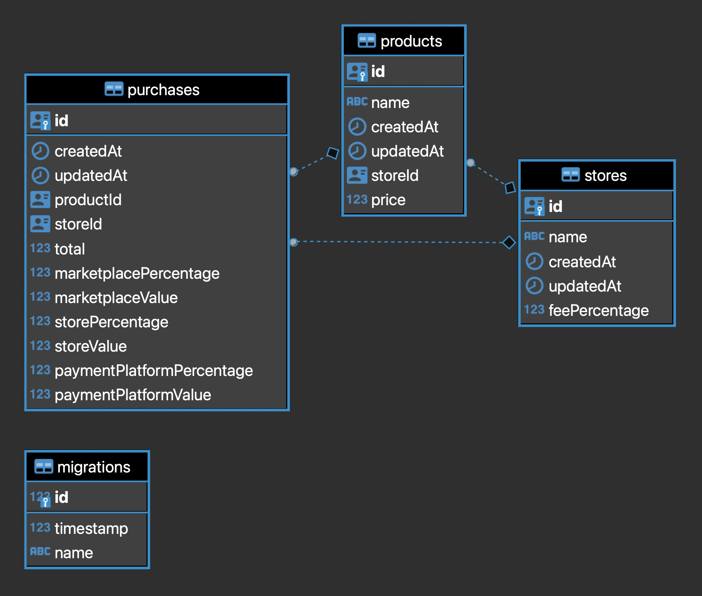

# test-marketplace
<br>
<br>

## Version
[](https://badge.fury.io/gh/tterb%2FHyde)

[](https://insomnia.rest/run/?label=TEST-Marketplace&uri=https://github.com/raulrr88/test-marketplace/blob/master/Insomnia_test_marketplace.json?token=AB6AVBVOVTL2RH5TCT6QA5DAJ3FLS)

<!-- [](https://dashboard.heroku.com/pipelines/pipe-test-marketplace/tests) -->

<br>
Click on Insomnia button to import all requests and tests to run in your machine.
<br>

----
<br>

## Tech Stack:
 - Javascript
 - Typescript
 - Node
 - GraphQL
 - Apollo GraphQL Server
 - Docker
 - Local: Postgres
 - Cloud: Heroku Postgres
 - Typeorm
 - Jest
 - ESLint
 - Prettier
 - ts-node-dev
 - TSyringe
 - Reflect-Metadata ( Decorators )
 - UUID V4
 - DotEnv
 - CI: Github Actions
 - CD: Heroku Pipeline
<br>
----
<br>
 ## Architecture and Design Keys:
 - Clean Architecture (Loose coupled and High Cohesion)
 - SOLID Principles
 - Query-driven schema design
 - Partially DDD
 - Data-Mapper and Repository Patterns
 - DRY, KISS and YAGNI

 - Flow with Layers:
 -- Queries --> Resolvers <--> Controllers <--> Services <--> Repositories <--> DB
<br>
----
<br>

## Data Model



<br>
----
<br>

## Backlog
- CI
- Pagination
- Insomnia Swagger Design
- Docker Local / Cloud
- Cache
- Batch
- Micro Services
- Apollo Federation Schema
- Apollo Gateway
- Kubernetes
- AWS Fargate

<br>
----
<br>

## How to run ( Local and Remote):
<br>

### LOCAL:
<br>

#### Install Docker:
- https://www.docker.com/products/docker-desktop
<br>
<br>

#### Install and Run Postgres DB on Docker:
```
docker run --name test-marketplace -e POSTGRES_PASSWORD=[PASSWORD] -p 5432:5432 -d postgres
```
<br>

#### List containers/apps running:
```
docker ps
```
<br>

#### Start DB on Docker ( if not running ):
```
docker start test-marketplace
```
<br>
----

#### Running project:
- Install dependencies with `yarn`.
- Run all migrations with `yarn typeorm migration:run`.
- Start the project with `yarn dev:server` for development.
<br>
<br>
OR
<br>
<br>

- Build with `yarn build`.
- Start the project with `yarn prod:server` for production version.
- `yarn lint` to check code lint.
<br>

#### Running tests:
 - Run `yarn test`
 - Check execute index.html on `coverage` folder.

#### Running lint:
 - Run `yarn lint`

<br>
----
<br>

### PS: Don't forget to create `.env` file in the root folder and to paste all environment variables.
Template
```
PORT=4000
NODE_ENV=development
DATABASE_URL=
```
<br>

### Insomnia - Query Tests:
Use Insomnia to Test all Queries and Flows, by clicking on the button bellow.
[](https://insomnia.rest/run/?label=TEST-Marketplace&uri=https://github.com/raulrr88/test-marketplace/blob/master/Insomnia_test_marketplace.json?token=AB6AVBVOVTL2RH5TCT6QA5DAJ3FLS)
<br>
----
<br>

### Production on Cloud:
Access application running on Heroku:
- https://app-test-marketplace.herokuapp.com
- You can also test with Insomnia, changing the Insomnia's environment to production.
